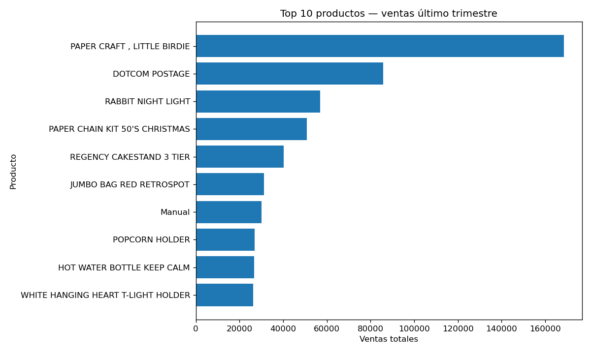

# Optimización de Inventario E-commerce

Análisis de demanda retail a partir de transacciones ([Online Retail II](https://www.kaggle.com/datasets/mashlyn/online-retail-ii-uci)): limpieza del histórico y ventas por producto en el último trimestre, base para ABC, forecast y punto de reorden.



## Qué hay en este repo

| Pieza | Descripción |
|-------|-------------|
| `notebooks/01_carga_limpieza_retail.ipynb` | Pipeline reproducible (carga → limpieza → agregación) |
| `inventario_ecommerce/` | Código reutilizable (`dataset`, `features`, `plots`) |
| `references/data_dictionary.md` | Columnas y reglas de limpieza |
| `data/raw/sample_online_retail.csv` | Sample para smoke-test sin Kaggle |

## Resultados (Online Retail II)

| Métrica | Valor |
|--------|------:|
| Filas raw | ~1.07M |
| Filas tras limpieza | ~1.04M |
| Periodo (último trimestre) | 2011-09-10 → 2011-12-09 |
| SKUs con venta | 3 444 |

## Cómo ejecutarlo

```bash
pip install -r requirements.txt
jupyter notebook notebooks/01_carga_limpieza_retail.ipynb
```

### Dataset completo

El CSV grande (~90 MB) **no** está en GitHub.

1. Descarga [Online Retail II UCI (Kaggle)](https://www.kaggle.com/datasets/mashlyn/online-retail-ii-uci)
2. Guárdalo como `data/raw/online_retail_II.csv`

Sin él, el sample local basta para validar el código.

## Estructura

```
data/raw|interim|processed|external
notebooks/
inventario_ecommerce/     # config, carga, limpieza, plots
references/               # diccionario de datos
reports/figures/          # gráfico de ejemplo versionado
```

## Roadmap

1. Clasificación ABC  
2. Features rolling de demanda  
3. Forecast baseline + punto de reorden  

## Stack

Python · pandas · numpy · matplotlib · Jupyter
