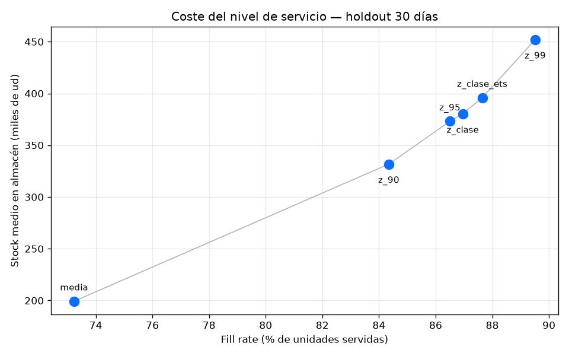

# Optimización de Inventario E-commerce

Convierte el histórico de facturas de un retailer online en una **tabla de reposición por SKU**: qué demanda se espera, a qué nivel de stock hay que volver a pedir y cuánto pedir. Y después simula esa política sobre datos que no vio, para saber cuántos quiebres evita y cuánto stock cuesta.

Datos: [Online Retail II (UCI / Kaggle)](https://www.kaggle.com/datasets/mashlyn/online-retail-ii-uci), ~1.07M líneas de factura entre 2009 y 2011.

## El entregable

`data/processed/inventory_reorder_recommendations.csv` — 2,963 SKUs activos. Las cinco primeras filas por demanda prevista:

| SKU | Descripción | ABC | Forecast (ud/día) | Modelo | Punto de reorden | Pedido sugerido |
|-----|-------------|:---:|------:|:---:|------:|------:|
| `22197` | Popcorn Holder | A | 259.9 | ets | 4,467 | 1,820 |
| `23084` | Rabbit Night Light | A | 218.6 | ets | 3,889 | 1,531 |
| `22086` | Paper Chain Kit 50's Christmas | A | 189.9 | ets | 3,451 | 1,330 |
| `84077` | World War 2 Gliders Asstd Designs | A | 146.9 | ma30 | 2,810 | 1,028 |
| `22578` | Wooden Star Christmas Scandinavian | A | 145.7 | ma30 | 2,750 | 1,020 |

- **Punto de reorden** — nivel de stock al que lanzar el pedido, stock de seguridad incluido.
- **Pedido sugerido** — demanda del ciclo de revisión (7 días), o `target − on_hand − on_order` si se aporta el stock físico.
- **Modelo** — `ets` en los 97 SKUs del top clase A donde Holt-Winters ajusta; `ma30` en el resto.

## Pipeline

1. **Limpieza** — nulos, devoluciones y líneas que no son producto físico (portes, ajustes, tests)
2. **ABC** — 80% / 95% de las ventas acumuladas del último trimestre
3. **Demanda diaria** — calendario continuo por SKU con los días sin venta a 0, cap al percentil 99 **de cada clase ABC** y exclusión de one-shots
4. **Forecast** — media móvil 30 días en todo el catálogo; Holt-Winters en el top 100 clase A
5. **Reorden** — `ROP = forecast_daily × LT + z × σ_30d × √LT`, con lead time 14 d, revisión 7 d y z por clase (1.88 / 1.65 / 1.28)
6. **Simulación** — se repone día a día sobre el holdout para medir quiebres y stock inmovilizado

Reglas de limpieza, parámetros y columnas de salida en detalle: [`docs/data_dictionary.md`](docs/data_dictionary.md).

## Resultados

Backtest temporal: se entrena con todo el histórico hasta el 2011-11-09 y se evalúa en los 30 días siguientes. El MAE se mide sobre el calendario completo, así que los días sin venta también puntúan.

| Grupo | Demanda media | MAE media móvil | MAE ETS |
|-------|------:|------:|------:|
| Catálogo (5,733 series) | 4.11 ud/día | 4.13 | — |
| Top 100 clase A | 53.03 ud/día | 40.47 | **37.04** |

A nivel de catálogo el error es del tamaño de la propia demanda: la mayoría de SKUs vende de forma esporádica y ahí una media móvil ya está cerca del techo de lo razonable. Donde hay volumen e historia —el top clase A— ETS reduce el MAE un 8.5% y gana en 69 de los 95 SKUs que ajustan.

No se reporta MAPE como métrica de decisión: con tantos días a cero en el denominador se dispara (~144%) y deja de ser informativo.


La media móvil es una recta: predice el mismo valor los 30 días y se queda corta durante la subida de Navidad. ETS sigue el nivel y el ciclo semanal, aunque nunca baja a cero en los días sin operación.

### Qué cuesta el nivel de servicio

El backtest mide el forecast; la simulación mide la decisión. Se repone día a día sobre el mismo holdout: llegan los pedidos, se sirve lo que hay, y lo que no se sirve se pierde. Cada política arranca con el stock que su propia regla exige.

| Política | Fill rate | Unidades perdidas | Stock medio (ud) | Días de cobertura |
|----------|------:|------:|------:|------:|
| Pedir la media (sin stock de seguridad) | 73.2% | 184,336 | 199,265 | 8.7 |
| z por clase ABC (la del proyecto) | **87.0%** | 89,848 | 380,216 | 16.6 |
| z por clase + forecast ETS | 87.6% | 85,095 | 395,917 | 17.2 |
| z = 2.33 uniforme (99%) | 89.5% | 72,189 | 451,964 | 19.7 |



Pedir la media no es una política: deja sin servir una de cada cuatro unidades. Pasar de ahí a la política del proyecto cuesta **1.9 unidades de stock parado por cada unidad extra servida**; el tramo siguiente, de la política del proyecto a z = 2.33, ya sale a 4.1. Diferenciar por clase hace lo que promete: la clase A queda en 91.7% de fill rate frente al 70.0% de la C, con menos stock total que un z uniforme del 99%.

Ninguna política llega al 90%, y ahí el problema no es el factor de seguridad: el holdout es la subida de Navidad, la demanda real se va por encima de la media entrenada y con 14 días de lead time no da tiempo a reaccionar. Lo que falta es nivel en el forecast, no z.

## Supuestos y limitaciones

Lo que este proyecto **no** resuelve, y conviene saber antes de leer los números:

- **No hay stock on-hand ni pedidos en curso.** El dataset son ventas, no inventario, así que el pedido sugerido es la demanda del ciclo de revisión. El pipeline ya calcula `target − on_hand − on_order` en cuanto se le da la fuente: basta un `data/raw/stock_on_hand.csv` con `StockCode`, `on_hand` y `on_order`.
- **Lead time y ciclo de revisión son supuestos** (14 y 7 días): no hay datos de proveedor.
- **El stock de seguridad asume normalidad.** `z × σ × √LT` supone demanda normal y lead time constante; la demanda real es intermitente, así que el nivel de servicio es aproximado, no garantizado.
- **El cap sigue recortando picos reales.** Por clase se queda en 315 ud/día (A), 183 (B) y 120 (C), frente a las 225 del cap global. Eso baja de 3,279 a 1,777 los días-SKU recortados en clase A, pero el máximo real de `22197` fueron 4,314 ud en un día: el MAE absoluto no es el error contra la demanda cruda. Los modelos se comparan sobre la misma serie recortada, así que la comparación entre ellos sí es válida.
- **Los sábados la tienda no factura** (400 facturas frente a 150-200k de cualquier otro día). Parte de los ceros del calendario no son demanda perdida, son días sin operación.
- **La simulación no tiene precios ni costes.** Compara unidades perdidas contra unidades en almacén, no euros de margen contra euros de capital inmovilizado. Tampoco modela backorders, capacidad de almacén ni lead time variable, y arranca cada política con su stock objetivo en la estantería: es un warm start, no una historia completa.

## Qué hay en este repo

| Pieza | Descripción |
|-------|-------------|
| `notebooks/01_carga_limpieza_retail.ipynb` | Carga, calidad de datos, limpieza y ventas del trimestre |
| `notebooks/02_forecast_reorder_baseline.ipynb` | ABC, backtest baseline y tabla de reorden |
| `notebooks/03_demand_hygiene.ipynb` | Qué cambia al rellenar ceros y recortar picos, y por qué el cap va por clase |
| `notebooks/04_forecast_class_a.ipynb` | Holt-Winters vs media móvil en el top clase A |
| `notebooks/05_policy_simulation.ipynb` | Quiebres vs stock inmovilizado de cada política |
| `inventario_ecommerce/` | Paquete: `config`, `dataset`, `features`, `modeling`, `plots` |
| `tests/` | Tests de limpieza, calendario, winsor, ABC, política y simulación |
| `docs/data_dictionary.md` | Esquema de entrada, reglas de limpieza y columnas de la salida |
| `data/raw/sample_online_retail.csv` | Sample para probar el código sin bajar Kaggle |

Las notebooks están versionadas **con sus outputs**, así que se leen en GitHub sin ejecutarlas.

## Cómo ejecutarlo

```bash
pip install -e ".[dev]"
python -m pytest
```

Pipeline completo:

```bash
python -m inventario_ecommerce.modeling.train      # backtests y métricas
python -m inventario_ecommerce.modeling.predict    # tabla de reposición
python -m inventario_ecommerce.modeling.simulate   # quiebres vs stock por política
```

Las notebooks siguen el orden **01 → 02**; la **03** justifica la higiene de demanda, la **04** compara modelos en clase A y la **05** simula la política de reposición.

### Dataset completo

El CSV de ~90 MB **no** está en el repo:

1. Descarga [Online Retail II UCI (Kaggle)](https://www.kaggle.com/datasets/mashlyn/online-retail-ii-uci)
2. Guárdalo como `data/raw/online_retail_II.csv`

Sin él, el sample local basta para validar el código.

## Estructura

```
inventario_ecommerce/     # paquete instalable
notebooks/                # 01 → 05, con outputs
tests/                    # pytest
docs/                     # diccionario de datos
data/                     # raw y processed (gitignored)
reports/figures/          # gráficos versionados
```

`train`, `predict` y `simulate` dejan en `data/processed/` la tabla de reposición y los intermedios (ABC, features rolling, métricas de backtest por SKU y resultados de la simulación).

## Stack

Python 3.13 · pandas · numpy · statsmodels · matplotlib · Jupyter · pytest

Licencia MIT (`LICENSE`).
