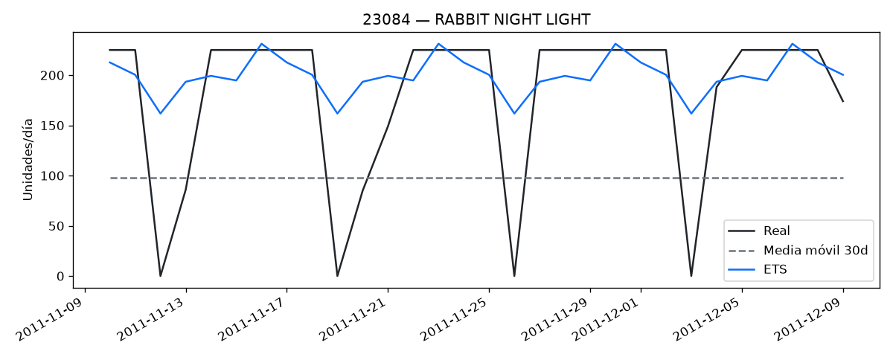

# Optimización de Inventario E-commerce

Convierte el histórico de facturas de un retailer online en una **tabla de reposición por SKU**: qué demanda se espera, a qué nivel de stock hay que volver a pedir y cuánto pedir.

Datos: [Online Retail II (UCI / Kaggle)](https://www.kaggle.com/datasets/mashlyn/online-retail-ii-uci), ~1.07M líneas de factura entre 2009 y 2011.

## El entregable

`data/processed/inventory_reorder_recommendations.csv` — 2,963 SKUs activos. Las cinco primeras filas por demanda prevista:

| SKU | Descripción | ABC | Forecast (ud/día) | Modelo | Punto de reorden | Pedido sugerido |
|-----|-------------|:---:|------:|:---:|------:|------:|
| `22197` | Popcorn Holder | A | 189.3 | ets | 3,235 | 1,325 |
| `23084` | Rabbit Night Light | A | 173.6 | ets | 3,001 | 1,215 |
| `22086` | Paper Chain Kit 50's Christmas | A | 149.0 | ets | 2,663 | 1,043 |
| `22578` | Wooden Star Christmas Scandinavian | A | 133.4 | ma30 | 2,460 | 934 |
| `84077` | World War 2 Gliders Asstd Designs | A | 131.4 | ma30 | 2,454 | 920 |

- **Punto de reorden** — nivel de stock al que lanzar el pedido, stock de seguridad incluido.
- **Pedido sugerido** — demanda del ciclo de revisión (7 días).
- **Modelo** — `ets` en los 97 SKUs del top clase A donde Holt-Winters ajusta; `ma30` en el resto.

## Pipeline

1. **Limpieza** — nulos, devoluciones y líneas que no son producto físico (portes, ajustes, tests)
2. **Demanda diaria** — calendario continuo por SKU con los días sin venta a 0, cap al percentil 99 y exclusión de one-shots
3. **ABC** — 80% / 95% de las ventas acumuladas del último trimestre
4. **Forecast** — media móvil 30 días en todo el catálogo; Holt-Winters en el top 100 clase A
5. **Reorden** — `ROP = forecast_daily × LT + z × σ_30d × √LT`, con lead time 14 d, revisión 7 d y z por clase (1.88 / 1.65 / 1.28)

## Resultados

Backtest temporal: se entrena con todo el histórico hasta el 2011-11-09 y se evalúa en los 30 días siguientes. El MAE se mide sobre el calendario completo, así que los días sin venta también puntúan.

| Grupo | Demanda media | MAE media móvil | MAE ETS |
|-------|------:|------:|------:|
| Catálogo (5,733 series) | 4.04 ud/día | 4.06 | — |
| Top 100 clase A | 49.47 ud/día | 36.79 | **32.40** |

A nivel de catálogo el error es del tamaño de la propia demanda: la mayoría de SKUs vende de forma esporádica y ahí una media móvil ya está cerca del techo de lo razonable. Donde hay volumen e historia —el top clase A— ETS reduce el MAE un 12% y gana en 71 de los 95 SKUs que ajustan.

No se reporta MAPE como métrica de decisión: con tantos días a cero en el denominador se dispara (~143%) y deja de ser informativo.



La media móvil es una recta: predice el mismo valor los 30 días y se queda corta durante la subida de Navidad. ETS sigue el nivel y el ciclo semanal, aunque nunca baja a cero en los días sin operación.

## Supuestos y limitaciones

Lo que este proyecto **no** resuelve, y conviene saber antes de leer los números:

- **No hay stock on-hand ni pedidos en curso.** El dataset son ventas, no inventario. Por eso el pedido sugerido es la demanda del ciclo de revisión y no `target − on_hand − on_order`.
- **Lead time y ciclo de revisión son supuestos** (14 y 7 días): no hay datos de proveedor.
- **El stock de seguridad asume normalidad.** `z × σ × √LT` supone demanda normal y lead time constante; la demanda real es intermitente, así que el nivel de servicio es aproximado, no garantizado.
- **El cap del percentil 99 (225 ud/día) recorta picos legítimos del top.** Protege la media de one-shots como `23843`, pero para `23084` 21 de sus 26 días de venta del holdout llegan al cap, cuando su máximo real fue 2,565 ud. Los dos modelos se comparan sobre la misma serie recortada, así que la comparación es válida; el MAE absoluto no es el error contra la demanda cruda.
- **Los sábados la tienda no factura** (400 facturas frente a 150-200k de cualquier otro día). Parte de los ceros del calendario no son demanda perdida, son días sin operación.
- **Se valida el forecast, no la política.** No hay simulación de quiebres ni nivel de servicio alcanzado; es el siguiente paso del proyecto.

## Qué hay en este repo

| Pieza | Descripción |
|-------|-------------|
| `notebooks/01_carga_limpieza_retail.ipynb` | Carga, calidad de datos, limpieza y ventas del trimestre |
| `notebooks/02_forecast_reorder_baseline.ipynb` | ABC, backtest baseline y tabla de reorden |
| `notebooks/03_demand_hygiene.ipynb` | Qué cambia al rellenar ceros y recortar outliers |
| `notebooks/04_forecast_class_a.ipynb` | Holt-Winters vs media móvil en el top clase A |
| `inventario_ecommerce/` | Paquete: `config`, `dataset`, `features`, `modeling`, `plots` |
| `tests/` | Tests de limpieza, calendario, winsor y ABC |
| `data/raw/sample_online_retail.csv` | Sample para probar el código sin bajar Kaggle |

Las notebooks están versionadas **con sus outputs**, así que se leen en GitHub sin ejecutarlas.

## Cómo ejecutarlo

```bash
pip install -e ".[dev]"
python -m pytest
```

Pipeline completo:

```bash
python -m inventario_ecommerce.modeling.train     # backtests y métricas
python -m inventario_ecommerce.modeling.predict   # tabla de reposición
```

Las notebooks siguen el orden **01 → 02**; la **03** justifica la higiene de demanda y la **04** compara modelos en clase A.

### Dataset completo

El CSV de ~90 MB **no** está en el repo:

1. Descarga [Online Retail II UCI (Kaggle)](https://www.kaggle.com/datasets/mashlyn/online-retail-ii-uci)
2. Guárdalo como `data/raw/online_retail_II.csv`

Sin él, el sample local basta para validar el código.

## Estructura

```
inventario_ecommerce/     # paquete instalable
notebooks/                # 01 → 04, con outputs
tests/                    # pytest
data/                     # raw y processed (gitignored)
reports/figures/          # gráficos versionados
```

`train` y `predict` dejan en `data/processed/` la tabla de reposición y los intermedios (ABC, features rolling, métricas de backtest por SKU).

## Stack

Python 3.13 · pandas · numpy · statsmodels · matplotlib · Jupyter · pytest

Licencia MIT (`LICENSE`).
